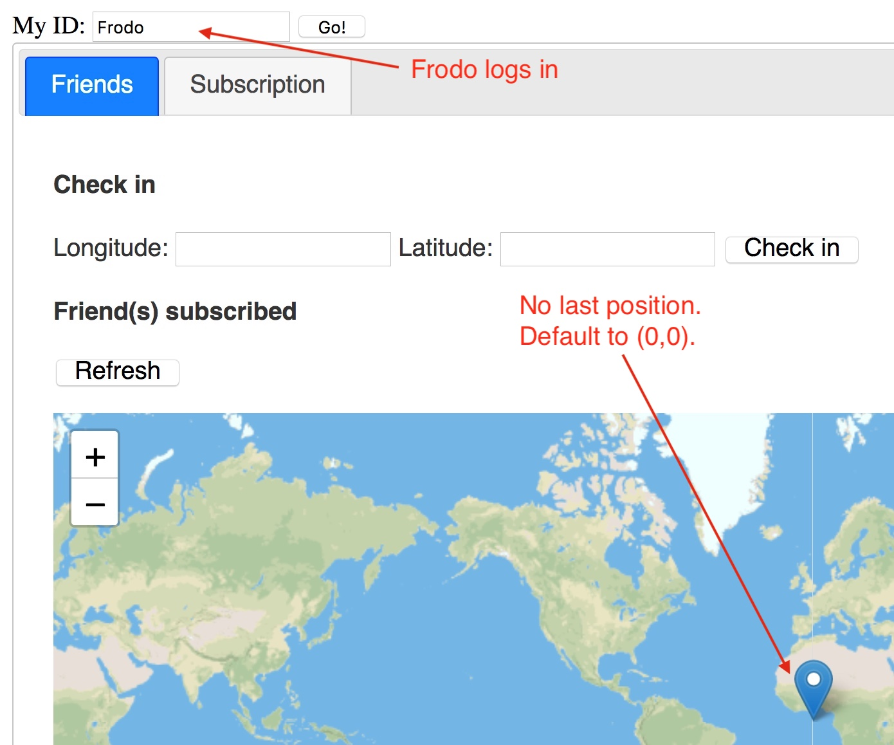
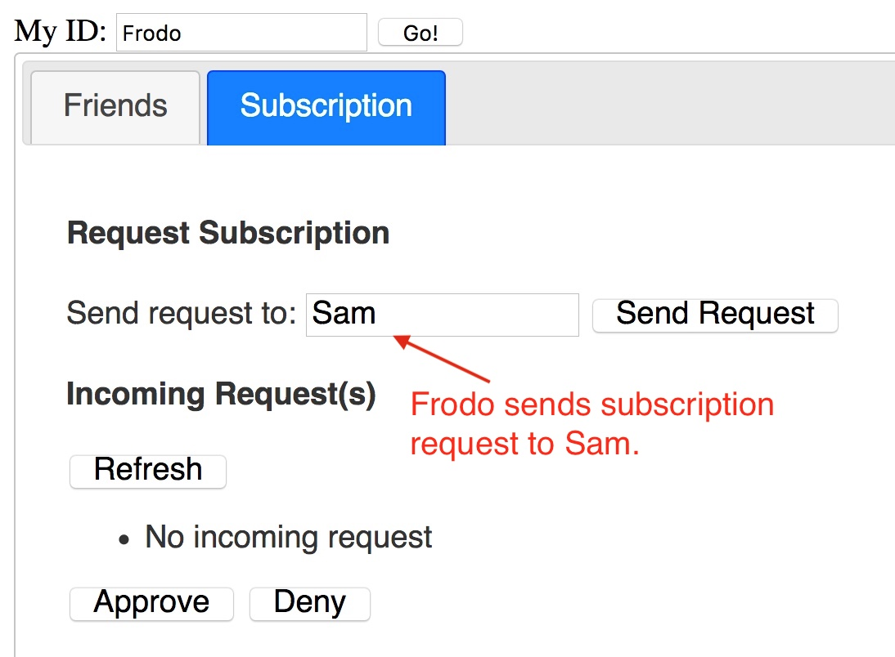
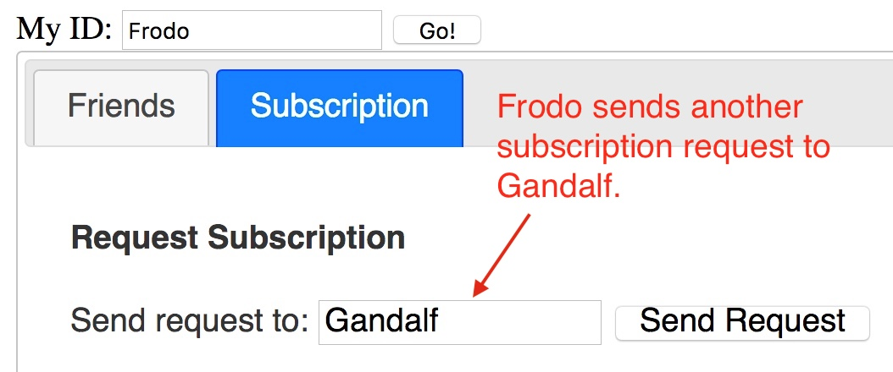
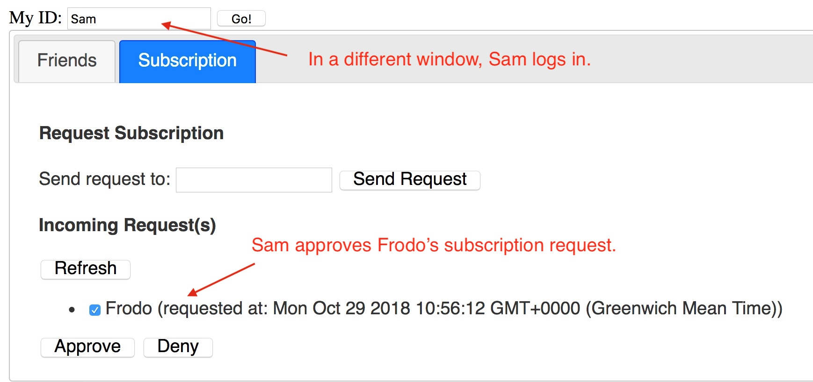
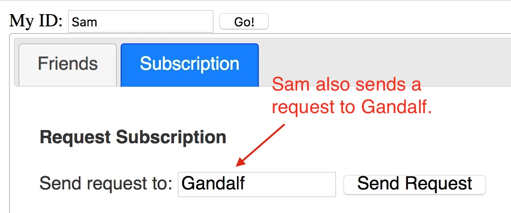
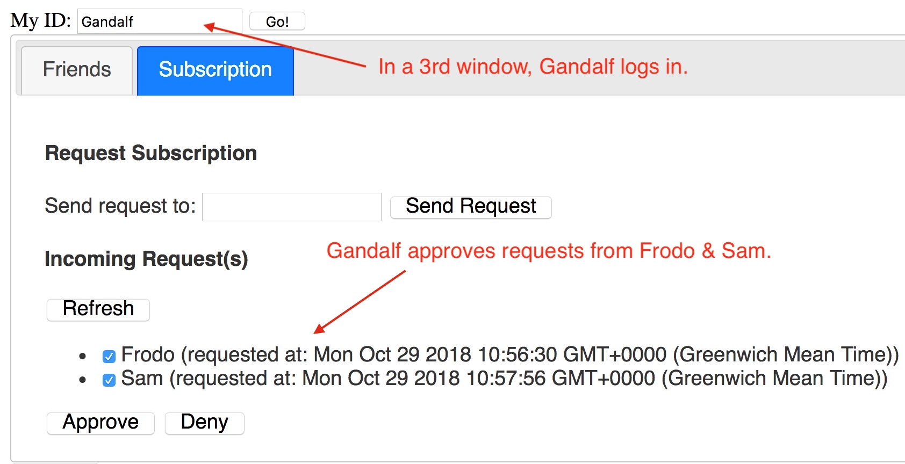
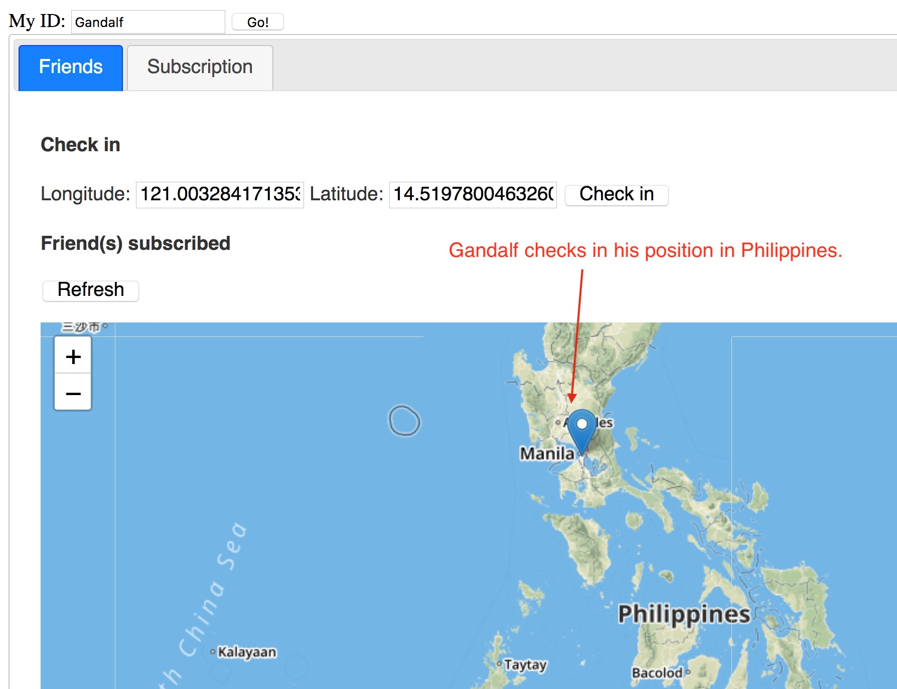
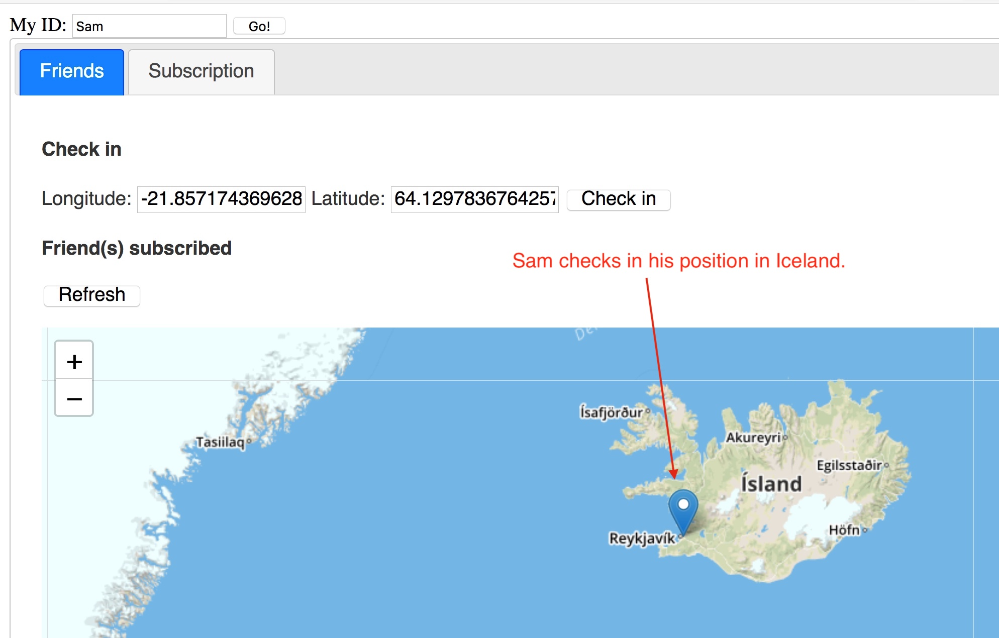
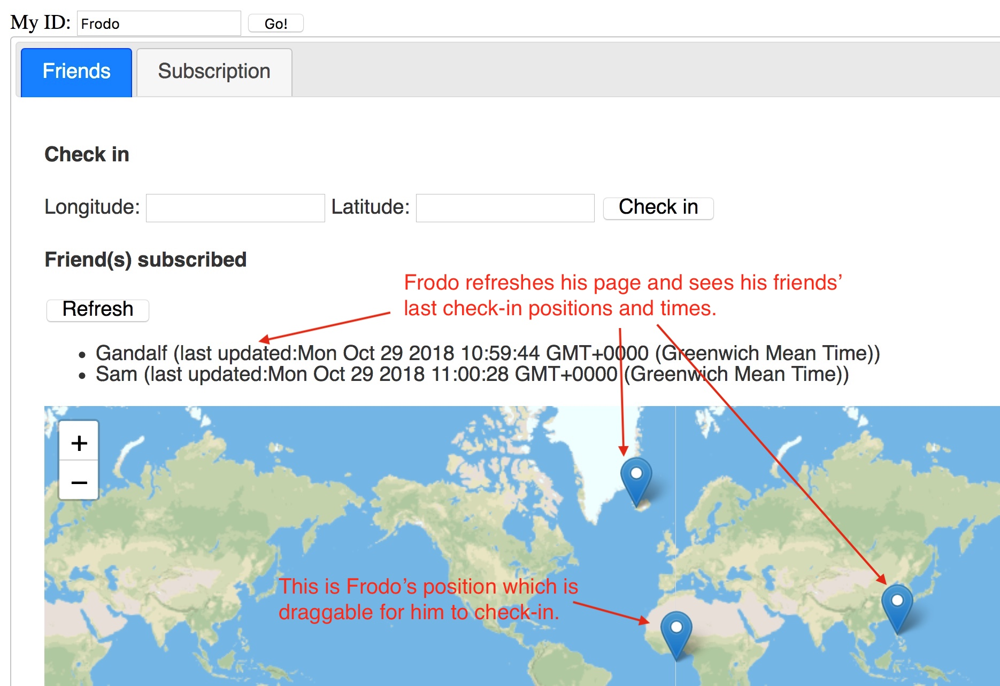
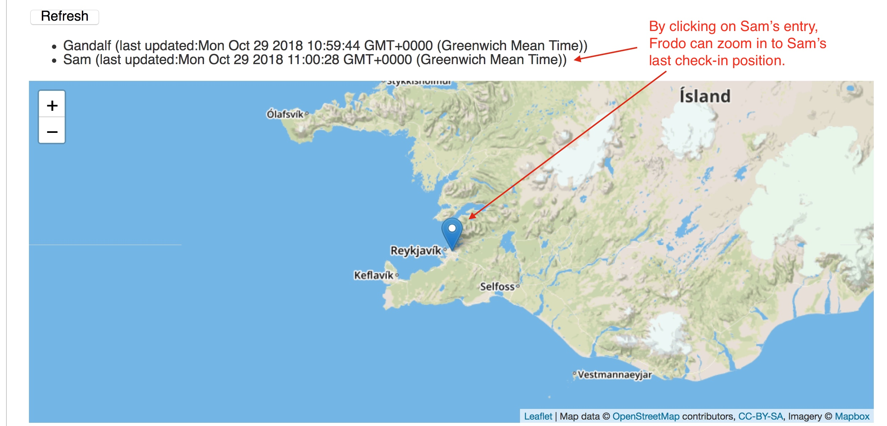

# Hints on Managing Date & Time Information

## Passing a Date & Time stamp to a web service

The easiest way to pass a date (and time) to a web service is to pass it as a long numeric value which contains both the date and time. The long value is the number of milliseconds since 1970-01-01 00:00. This avoids the problem of passing a string like "2017-02-28 12:30" as a parameter and then parse it into a Java/JavaScript representation. It also avoids the problem of having different date and time representations.

## Converting between a long value to a Date in JavaScript/Java

Both JavaScript and Java can convert between a long and a Date (either JavaScript/Java) object easily. W3School has some good examples of JavaScript here: http://www.w3schools.com/jsref/jsref_obj_date.asp

In the above page you can also see the methods defined on a JavaScript Date object which allow you to get/set the year, month, day, hour, minute of a Date object. That means once you have a Date object (created from a long value) in JavaScript, you can choose how to display it on a web page.

The conversion between a long and the Java Date object is well-documented in the API document of the `java.util.Date` class.

# Hints on LeafletJS and Mapbox

In the past we used the GoogleMap JS API but recently Google has started asking users to register with a payment card, even though there is a free quota and you won't be charged unless you use over the free quota. As I cannot assume everyone has a payment card, I would suggest the use of LeafletJS and Mapbox.

## LeafletJS & Mapbox

LeafletJS is a JavaScript library for showing an interactive map in a webpage. JavaScript examples of showing a basic map is here: https://leafletjs.com/examples/quick-start/

LeafletJS does not provide the map information but uses a "tile provider". A free title provider is Mapbox. You can signup Mapbox for free. Every month there are 50000 free map requests. If you use beyond your free quota then you'll need to pay on a Pay-As-You-Go basis.

Get a Mapbox API key. In the LeafletJS quick-start examples, you will see where to insert your Mapbox API key to make the map work.

## API Document

The LeafletJS API document is available here: https://leafletjs.com/reference-1.3.4.html

Here are some specific classes that you will need:

### LatLng

A LatLng object represents a location on a map. It is made up of its longitude and latitude values. An easy way to create a LatLng object to use a JS map:
```javascript
var myLocation = L.LatLng({lat:yyy, lng:xxx});
```
The longitude and latitude of a LatLng object can be accessed as JS properties:
```javascript
var longitude = myLocation.lng;
var latitude = myLocaiton.lat;
```

### Map

To create a Map object and put it into a DIV with id "mapDivID", centre on a location with a zoom level:
```javascript
var myMap = L.map('mapDivID').setView(myLocation,zoomLevel);
```
To pan the map to another location specified by a LatLng object:
```javascript
myMap.panTo(anotherLocation);
```

### Marker

To create a marker at a location with options (which is a JS map):
```javascript
var myMarker = L.marker(myLocation,options);
```
To add a marker to a map:
```javascript
myMarker.addTo(myMap);
```
To get the location of a marker as a LatLng object:
```javascript
var location = myMarker.getLatLng();
```

# Demo Screenshots

## Frodo first logs into the system. At the moment he has no subscription to any friend



## Frodo sends a subscription request to Sam



## Frodo sends another subscription request to Gandalf



## Sam logs in and approves Frodo's subscription request



## Sam proceeds to send a subscription request to Gandalf



## Gandalf logs in and sees 2 subscription requests, approving both



## Gandalf drags his marker to Philippines and checks in his position



## Sam drags his marker to Iceland and checks in his position



## Frodo refreshes his page and now sees his friends' last check-in times and positions



## By clicking on Sam's entry, the map zooms in to Sam's last check-in location

